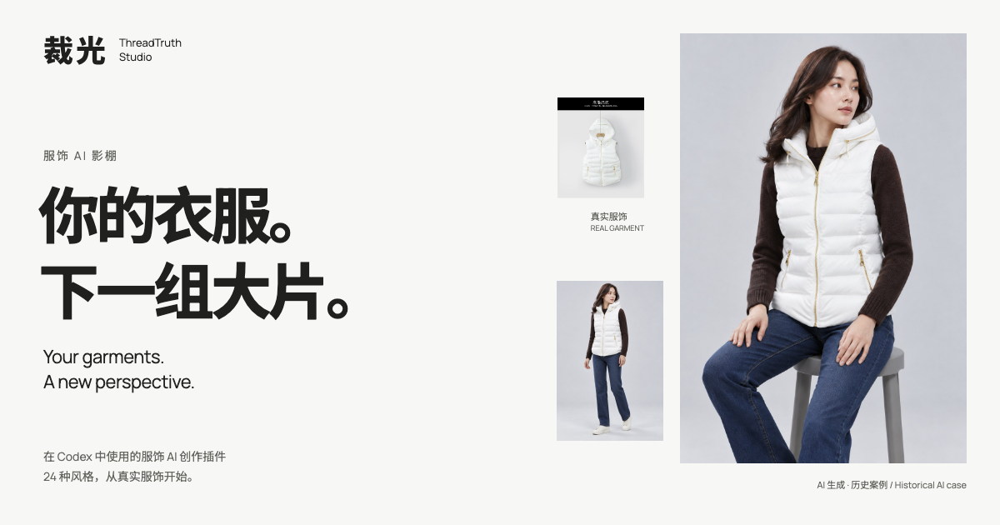

# 裁光 · ThreadTruth Studio

[](https://denggui-ai.github.io/threadtruth-studio/)

**从真实服饰照片出发，以源图细节为依据，探索 24 种风格的 AI 模特图。**<br>AI fashion portraits in 24 styles, guided by your real garment photos.

**[开始安装 · Install](docs/INSTALL.md#简体中文)**　·　**[查看成片 · See results](https://denggui-ai.github.io/threadtruth-studio/#complete-case)**　·　**[探索 24 风格 · Explore styles](https://denggui-ai.github.io/threadtruth-studio/#style-highlights)**

[English guide](README.md) · [中文说明](README.zh-CN.md) · [产品首页 / Website](https://denggui-ai.github.io/threadtruth-studio/)

## 你可以用它做什么

- **让服饰细节有据可依。** 从真实单件服饰或完整套装出发，以源图中的颜色、结构、廓形及搭配配饰指导结果。
- **选择 24 种视觉方向。** 查看风格推荐或自行选择，覆盖电商棚拍与时尚编辑等方向。
- **制作逐步验收的人像套组。** 生图前确认方案，检查首张结果，再继续生成尺寸一致的独立人像。

裁光插件安装在 **Codex** 中，插件名称仍显示为 **ThreadTruth Studio**。默认在 Codex 生图；也可明确选择下方说明的 ChatGPT 网页转交路线。

## 三步开始

**需要准备：** macOS、Python 3、终端，以及支持 `codex plugin add` 的 Codex CLI。目前只有这一环境经过测试；Windows、Linux 和全新机器尚未验证。首次识别不生成图片；之后生图需要具备原生生图能力的 Codex 账号，选择网页路线时则需要有生图权限的 ChatGPT 账号。

1. 按[中文安装指南](docs/INSTALL.md#简体中文)下载 beta.8 插件 ZIP 与匹配的 `.sha256`，检查环境、校验归档并启用插件。请选择有完整插件名称的下载项，不要使用 GitHub 自动生成的源码 ZIP。
2. 新建一个 **Codex 任务**，上传你有权使用的真实单件服饰或完整套装照片。
3. 先请求识别与风格推荐：

```text
请用 $threadtruth-studio 识别并推荐风格，不要生图
```

预期返回服饰识别卡、主推与备选方向，以及完整的 24 风格目录。这一步**不授权生图**。随后确认风格、构图、尺寸和张数，再明确授权生成；生图会使用所选账号的图片额度。

没有返回识别结果时，先看[安装排查](docs/INSTALL.md#安装排查)。安装成功或失败都可通过[安装反馈表](https://github.com/denggui-ai/threadtruth-studio/issues/new?template=installation-feedback.yml)简短反馈。

## 选择在哪里生图

| 入口 | 使用方式 | 需要什么 |
|---|---|---|
| **Codex · 默认** | 授权后在 Codex 内生成，首张通过检查后再继续套组。 | 宿主具备原生生图能力，账号有可用额度。 |
| **ChatGPT 网页 · 明确选择** | Codex 准备编号参考图与提示词，由你手动转交，或授权 Codex 操作受支持的浏览器。 | ChatGPT 账号有生图权限和额度；自动执行还需要宿主提供上传文件、下载原图的浏览器工具。 |

裁光安装在 **Codex** 中。ChatGPT 入口按[网页教程](docs/CHATGPT-WEB-TUTORIAL.md)转交，安装插件本身不会安装浏览器工具。参考图上传 ChatGPT 需要授权；失败或状态不明时先检查原请求，重试须另行授权，已用次数会保留。[网页流程说明](docs/CHATGPT-WEB.md)。

## 案例与验证范围

[](docs/demo/primary-cases/white-hooded-puffer-vest-korean-cold/README.md)

**4 张源图 → 6 张独立 AI 人像。** 这组历史案例已完成人工验收，与配对图库分开记录，也不是 beta.8 新生成的结果。[查看完整案例与媒体条款](docs/demo/primary-cases/white-hooded-puffer-vest-korean-cold/README.md)。

**24 风格配对图库**展示 Codex 与 ChatGPT 网页端的结果，附来源署名、权利披露和逐组评审。图片为 AI 合成研究对照，不代表模型排名，也不代表每张图片均可自由复用。[查看图库来源与权利记录](https://denggui-ai.github.io/threadtruth-studio/rights.json)。

| 集合 | 已公开内容 | 能说明什么 |
|---|---|---|
| [配对比较图库](https://denggui-ai.github.io/threadtruth-studio/compare.html) | **24 风格 × 2 个入口 = 48 张图片** | 同一输入的结果对照，含评审与权利披露；不等于 24 套完整六图交付，也不代表 beta.8 全风格验证。 |
| [白马甲完整案例](docs/demo/primary-cases/white-hooded-puffer-vest-korean-cold/README.md) | **1 种风格 × 6 张独立成片** | 一组完成人工验收的完整案例；公开主案例风格索引仍为 **1/24**。 |
| 历史方向预览 | **2 个集合 × 24 种风格** | 每种风格一张六姿势看板，经过版式检查与维护者验收；保留白马甲 beta.3、套装 beta.4 的原始证据。 |

<details>
<summary>展开历史单件服饰与完整套装预览</summary>

| 真实完整套装源图 | AI 合成的六姿势方向预览 |
|---|---|
|  |  |

**完整套装 · 24种风格** — 米色西装、白色上衣、深色牛仔裤、橄榄色托特包和棕色乐福鞋作为一套搭配锁定。此处是一张预览看板。[查看套装全部 24 张看板](docs/demo/style-previews/beige-blazer-denim-outfit-24-v1/)（GitHub 上列出图片文件；目录中的 `index.html` 是供下载后本地打开的图库页） · [媒体权利](docs/demo/RIGHTS.md)。

**单件服饰 · 24种风格** — 下方缩略图来自冻结的白马甲集合，点击可查看单张六姿势大图。[风格证据索引](docs/demo/STYLES.md) · [历史任务台账](docs/WORK-STATUS.md)。

<!-- STYLE_PREVIEWS:START -->

| | | | |
|---|---|---|---|
| <a href="docs/demo/style-previews/white-vest-24-v1/american-street-display.jpg"></a><br>American Street | <a href="docs/demo/style-previews/white-vest-24-v1/athleisure-display.jpg"></a><br>Athleisure | <a href="docs/demo/style-previews/white-vest-24-v1/balletcore-display.jpg"></a><br>Balletcore | <a href="docs/demo/style-previews/white-vest-24-v1/british-heritage-display.jpg"></a><br>British Heritage |
| <a href="docs/demo/style-previews/white-vest-24-v1/cityboy-display.jpg"></a><br>Cityboy | <a href="docs/demo/style-previews/white-vest-24-v1/clean-fit-display.jpg"></a><br>Clean Fit | <a href="docs/demo/style-previews/white-vest-24-v1/coquette-ladylike-display.jpg"></a><br>Coquette Ladylike | <a href="docs/demo/style-previews/white-vest-24-v1/ecommerce-studio-display.jpg"></a><br>E-commerce Studio |
| <a href="docs/demo/style-previews/white-vest-24-v1/french-effortless-display.jpg"></a><br>French Effortless | <a href="docs/demo/style-previews/white-vest-24-v1/gorpcore-display.jpg"></a><br>Gorpcore | <a href="docs/demo/style-previews/white-vest-24-v1/guochao-street-display.jpg"></a><br>Guochao Street | <a href="docs/demo/style-previews/white-vest-24-v1/italian-luxe-display.jpg"></a><br>Italian Luxe |
| <a href="docs/demo/style-previews/white-vest-24-v1/japanese-lifestyle-display.jpg"></a><br>Japanese Lifestyle | <a href="docs/demo/style-previews/white-vest-24-v1/korean-cold-editorial-display.jpg"></a><br>Korean Cold Editorial | <a href="docs/demo/style-previews/white-vest-24-v1/korean-menswear-display.jpg"></a><br>Korean Menswear | <a href="docs/demo/style-previews/white-vest-24-v1/neo-chinese-display.jpg"></a><br>Neo Chinese |
| <a href="docs/demo/style-previews/white-vest-24-v1/nordic-minimal-display.jpg"></a><br>Nordic Minimal | <a href="docs/demo/style-previews/white-vest-24-v1/office-commute-women-display.jpg"></a><br>Office Commute Women | <a href="docs/demo/style-previews/white-vest-24-v1/old-money-display.jpg"></a><br>Old Money | <a href="docs/demo/style-previews/white-vest-24-v1/preppy-display.jpg"></a><br>Preppy |
| <a href="docs/demo/style-previews/white-vest-24-v1/quiet-luxury-display.jpg"></a><br>Quiet Luxury | <a href="docs/demo/style-previews/white-vest-24-v1/resort-vacation-display.jpg"></a><br>Resort Vacation | <a href="docs/demo/style-previews/white-vest-24-v1/workwear-vintage-display.jpg"></a><br>Workwear Vintage | <a href="docs/demo/style-previews/white-vest-24-v1/y2k-millennium-display.jpg"></a><br>Y2K Millennium |

<!-- STYLE_PREVIEWS:END -->

历史预览的来源、评审与哈希记录继续保留，不作为当前运行时视觉质量、新增完整案例或非维护者采用的证明。

</details>

## 适用范围与限制

裁光 · ThreadTruth Studio 由社区独立维护，不是 OpenAI 官方产品，也不代表官方背书。安装与启用已在维护者的 macOS 本机验证，非维护者新环境仍待验证。详见[兼容性与验证范围](docs/COMPATIBILITY.md)。

- **以源图细节为依据。** 颜色、材质观感、廓形、结构、图案和 Logo 位置来自源图；完整套装还包括层次、比例及鞋包配饰。生成后仍需对照源图检查，不能保证小字、Logo 或合体效果完全准确。
- **交付需要人工验收。** 适用于服饰图像，不适用于通用虚拟试衣、CAD 合体模拟、非服饰商品、纯文字概念图、API 集成或无人值守商业交付；不保证平台审核通过或销售效果。
- **风格名称只描述视觉方向。** 带性别或文化名称的风格，不用于推断人物身份、族裔、国籍、身体或性别。
- **使用有授权的素材，单独核对图片权利。** 生成结果需要适用的 AI 内容标识；图库公开不表示第三方权利已全部清理，应查看逐组披露。Apache-2.0 覆盖代码和文档，不覆盖演示媒体。
- **生图能力由所选宿主提供。** 插件不增加 API key 流程、第三方生图服务、MCP 服务或遥测。工具不可用时仍可识别和准备提示词，生图暂停；也可明确选择网页转交入口。

## 文档与反馈

[安装、升级与回滚](docs/INSTALL.md) · [兼容性](docs/COMPATIBILITY.md) · [离线指南](USER-GUIDE.html)（随插件 ZIP 提供，请在本地用浏览器打开；GitHub 上只显示 HTML 源码） · [更新记录](CHANGELOG.md) · [Beta 进度](docs/BETA.md)

**当前预发布版：beta.8。** 新增 ChatGPT 网页转交、请求记录与受控重试。旧版本和对应图库作为历史记录保留；安装旧版时使用其归档内的指南。Beta 退出目标与待验证事项见 [Beta 登记](docs/BETA.md)。

安装结果可通过[反馈表](https://github.com/denggui-ai/threadtruth-studio/issues/new?template=installation-feedback.yml)提交；Bug 使用 [Issues](https://github.com/denggui-ai/threadtruth-studio/issues)，一般问题使用 [Discussions](https://github.com/denggui-ai/threadtruth-studio/discussions)。公开反馈前请去除私有服饰图、客户数据、凭据和完整日志。维护者：DENGGUI · 微信：`Lvmusic0930`。

<details>
<summary>开发与项目记录</summary>

```bash
python3 -m unittest discover -s tests -v
python3 tools/pack-lint.py --strict skills/threadtruth-studio/references/styles/*.pack.yaml
python3 tools/trigger-eval.py
python3 tools/build-release.py
```

运行时位于 `skills/threadtruth-studio/`；测试、eval、发布工具和证据位于其外。另见[贡献指南](CONTRIBUTING.md)、[安全策略](SECURITY.md)、[迁移说明](MIGRATION.md)与[来源记录](PROVENANCE.md)。项目 Beta 目标不属于 OpenAI 准入规则，申请说明单独保存在 [Codex for Open Source](docs/CODEX-FOR-OSS.md)。

</details>
