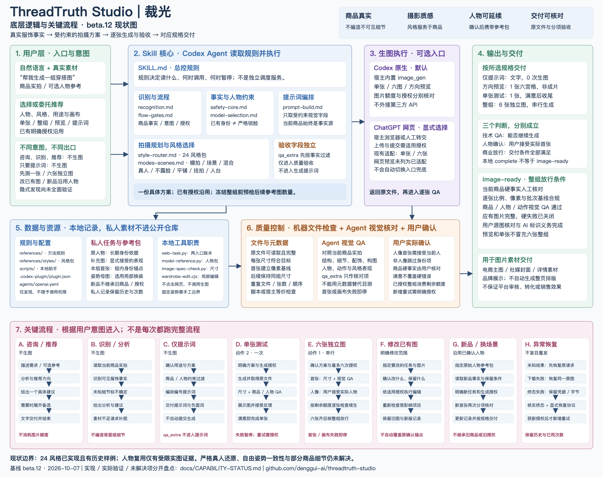

# 裁光能力清单与现状拓扑 / Caiguang capability topology

核对：**2026-10-08，当前源码**，包含通用参考执行修正和真人朝向计划（运行源码 `36625a2`）。PR #37已合并，维护者本机已备份安装并启用该修订，见[安装核验](verification/2026-10-08-real-face-local-install.md)；公开 **beta.12 ZIP** 仍为此前发行内容。图示说明已有职责、依赖和关键分支，不构成新的运行规则、生成授权或额外视觉验证。

[打开高清PNG](assets/architecture-overview.png) · [可缩放SVG](assets/architecture-overview.svg) · [当前能力状态与缺口](CAPABILITY-STATUS.md)

本图面向用户，按七个分区解释「谁负责什么、数据如何流动、各类请求怎么结束」。主路径是：**真实素材 → Agent读取规则并规划 → 获授权后使用所选生图入口 → 原文件检查 → 视觉QA → 用户确认 → 对应规格交付**。咨询和提示词有独立的无生图出口；预览不进入商业成片放行。

图的可维护源文件是[绘图脚本](architecture/build_overview.py)，输出同一份SVG，再由浏览器将该SVG渲染为PNG。SVG中的文字不是生图模型生成的；修改在源脚本中进行，不手改一张容易失真的位图。本次文档重用已保留的源码与两张限定验收证据，不新增运行规则。

## 能力清单

“已实现”指已有指令或本地工具，不等于所有素材、姿势、宿主都已实图验证。

| 能力 | 用户输入与交付 | 现状及边界 |
|---|---|---|
| 素材核对与服饰识别 | 单件、完整套装、多角度实拍 → 可见服饰事实及缺项 | 只依据当前商品实拍；未知细节不能编造，多套逐套处理 |
| 24风格选择 | 明确偏好或委托推荐 → 一个具体方向，备选/目录按需展开 | 注册风格库与路由已实现；不代表当前版24套六图都通过 |
| 人物选定与条件调整 | 已有真人/AI参考，或无固定人物 → 沿用身份/推荐新人物 | 按声明的real/ai/new来源分流，真人按真实脸向覆盖；AI保持原流程；不保证严格真人还原；童装沿用原安全路径 |
| 拍摄与呈现 | 风格、用途及要求 → 棚拍/场景/混合，真人/不露脸/平铺/挂拍/人台 | 自动推荐在三种模式中选；非人像跳过人物身份流程，各形式实图证据不同 |
| 用途与画布 | 电商主图、社媒封面、详情页、品牌展示 → 构图与比例/像素要求 | 明确像素/比例优先；逐张核元数据，不自动生成整页详情、带字海报或保证平台通过 |
| 四种交付 | 仅提示词、方向预览、单张测试或六张独立图 | 提示词0次；预览1次非成片；明确单张呈现覆盖默认母版；整组最多6次串行，首张/画布失败暂停 |
| 两种制作入口 | 已确认方案 → Codex原生，或明确选择ChatGPT网页 | 默认Codex；网页适配单张/六张，需宿主浏览器或手动转交，不自动切换、不用API兜底 |
| 验收与修正 | 原图、结果及反馈 → 人物/商品/用途/画布分项结论 | 技术QA与用户选人分开；只对有依据且获授权的指定图片修正，硬错误不能由满意覆盖 |
| 人物参考包复用 | 已确认人物与新品 → 沿用原始人物依据和已确认条件 | 新聊天需提供包/明确位置；不继承旧商品，新品首张仍需核对；已有受限实图样本 |
| 固定姿势局部换装 | 已确认母图及新品 → 保留姿态的局部编辑结果 | 需手工边界、头脸保护及本地合成校验；依赖现有Node/sharp，不支持自动遮罩或任意转头 |
| 对话与任务恢复 | 一份具体方案、实际授权与反馈 → 执行/继续/恢复/停止 | 已有授权沿用；累计次数、原图和失败历史保留；新简化流程未全面实测 |
| 安装与分发 | Codex插件包 → 预检、备份升级、启用及回滚 | 本机与beta.12发行包已核验；新机器与隐式发现不作普遍通过声明 |

## 如何读这张图

1. **用户层**提供当前素材、意图及实际反馈；入口发现不会自动授予生图权限。
2. **Skill核心**由Codex Agent读取和执行，商品事实、人物条件与风格共同约束提示词；`qa_extra`只用于验收。
3. **生图执行层**是可选的工具调用。原生默认、网页显式选择，两入口不会自动互相兜底；本地脚本不生图、不点击网页。
4. **输出层**按提示词、预览、单张或整组分别交付。技术通过、实际人物接受与商业放行是三件事。
5. **资源层**保存规则与私人版本化任务；人物包由用户指定，新品不继承旧商品和旧授权。
6. **质量层**结合文件元数据、Agent视觉核对与用户实际确认，机器通过不能替代商品人工核对。
7. **流程层**按意图进入A–H；失败时先恢复原请求，只有适用授权才能新增调用。非人像跳过人物身份项。

### 当前版本的人物复用逻辑

这些关系来自当前[人物规则](../skills/threadtruth-studio/references/model-selection.md)及[固定姿势分支](../skills/threadtruth-studio/references/fixed-pose-wardrobe.md)，不是从旧聊天或示例图推导的。

| 数据角色 | 当前职责与优先级 |
|---|---|
| 当前商品实拍 | 当前服饰事实源；人物参考里的旧衣服、配饰和背景不自动进入新品条件 |
| 原始人物参考 | 长期身份依据，始终保留；不能被最新生成图静默替换；仅脸照不证明原身体 |
| 已确认补充图 | 用户显式选用的生成表现，按face/full范围补充；不能覆盖原始身份、认证真人未知方向或成为新授权；真人包仍为real |
| 本组已确认首张 | 只作本组identity-only锚点；后五张仍结合当前商品、原始身份及已选补充图 |
| 编辑目标 / 固定姿势母图 | 普通修正图仅作edit-target；母图仅在明确选择固定姿势局部换装时使用；两者均不替代长期身份源 |
| 用户本次调整 | 明确新妆发/表情等要求覆盖同轴旧目标和风格默认；未要求改妆发时沿用参考；固定母图保护区冲突须先处理 |

采用真人逐张计划时，完整库存可以超过5图；每张选择记录保留原始身份、实际角度依据、商品源及适用的编辑目标，说明省略冗余图的理由。实际原生请求每次最多5张附件，本组首张也计入。**冻结整组前就预检后五张**：为原始身份、已选补充图和本组首张预留位置，按可见事实选足商品视图；不静默丢掉身份或关键商品图。新聊天由用户指定人物包，不承诺自动记忆；新品任务仍重新核对首张，不继承旧商品或旧授权。

### 真人参考与背部展示的分支

人物来源已明确时直接沿用；来源不明且影响分流才核对，不按照片外观或是否上传图片判断。

| 人物与商品素材 | 脸部与第六张的处理 |
|---|---|
| 真人只有正脸 | 露脸使用正面/近正面；六张身体动作仍不同，头颈保持自然 |
| 真人有清晰多角度 | 仅使用实际真实覆盖方向；AI补充不证明未知方向 |
| 有商品真实背面，无对应真人回眸图 | 第六张保留背部展示、自然不露脸，并明示取消露脸回眸 |
| 没有商品真实背面 | 原第六张正面自然站姿替代；人物多角度不能补商品背面事实 |
| 已有AI参考 / 新AI模特 | 原六姿势、头向、首张确认与复用流程保持；继续原一致性QA |
| 仅借鉴姿势 / 风格 | 不触发真人身份限制 |

身体动作、头部朝向和眼球视线分别规划；用户指定未覆盖方向、原六姿势不变或全部露脸且与素材冲突时，明确对应编号并提供补真实图或调整该编号的选择。`real_face_plan`只编排真人身份任务；工具校验引用与实际请求绑定，不自动识脸或认证手工角度判断。

### 当前版本的失败分流

- **首张技术或人物确认未通过**：不推进后五张。
- **任意一张的比例或批次像素失配**：立即停止后续未调用编号。
- **后续look-2至6普通服饰/构图QA失败**：保留`qa-retry`；可继续当前已授权闭集中的其它编号，但不自动重试失败图，也不能把整组标为商业放行。
- **结果未知、下载失败与已知终态失败**：分别按原请求恢复、同一原图下载恢复、保留证据后核实终态处理；旧schema2须显式采用恢复协议，新增重试还须适用的新授权。

依据：[flow-gates §5b](../skills/threadtruth-studio/references/flow-gates.md)、[逐张画布门禁](../skills/threadtruth-studio/references/prompt-build.md)及下方状态表。该区分不改变调用上限。

### 本地工具具体负责什么

| 组件 | 职责 | 不负责什么 |
|---|---|---|
| [插件元信息](../.codex-plugin/plugin.json)与[入口元数据](../skills/threadtruth-studio/agents/openai.yaml) | 发现、显示、默认提示与调用策略 | 不授予生图/上传授权；允许隐式调用不证明所有隐式触发成功 |
| [SKILL.md](../skills/threadtruth-studio/SKILL.md)与核心参考 | 定义输入、选择、执行、QA和停止规则 | 不自动执行工具，不是独立调度服务 |
| [风格路由](../skills/threadtruth-studio/references/style-router.md)与[24风格包](../skills/threadtruth-studio/references/styles/) | 视觉字段参与受约束提示词，QA字段只用于验收 | 不把整个pack原样拼进提示词，不改商品事实 |
| [web-task.py](../skills/threadtruth-studio/scripts/web-task.py) | 原生/网页本地账本，授权记录、预留、回执、尺寸/重复检查、QA/人物确认、恢复与导出 | 不点击Send、不生图、不认证用户实际给过授权、不代替视觉验收；complete不等于image-ready |
| [real_face_plan.py](../skills/threadtruth-studio/scripts/real_face_plan.py) | 校验真人实际覆盖、逐张body/head/gaze计划及有序参考选择，将条件编入请求 | 不识脸、不判断照片真假、不认证未知真实角度、不改变AI路径或保证锁脸 |
| [model-reference.py](../skills/threadtruth-studio/scripts/model-reference.py)及其实现 | 读取、校验和导出私人原始人物、补充图及显式母图 | 不训练模型、不保证锁脸、不把人物包变成商品事实或授权 |
| [wardrobe-edit.cjs](../skills/threadtruth-studio/scripts/wardrobe-edit.cjs) | 可选固定母图的prepare/preflight/apply/verify与局部保护合成 | 不生成供图，不自动判断遮罩，不保证不同母图脸一致或原真人还原 |
| [image-spec-check.py](../skills/threadtruth-studio/scripts/image-spec-check.py)或宿主等价只读检查 | 对实际文件读取并核对比例、像素与同组一致性；网页导入也有自身文件检查 | 不目测代替元数据，不判断商品、身份或商业适用性；不要求所有路线必调同一脚本 |

## 关键分支与状态边界

| 情况 | 下一步与保留条件 | 应核对的规则/回归 |
|---|---|---|
| 只咨询/识别/看风格/要提示词 | 文字出口，不调用生图；已有完整授权不重复询问 | [flow-gates](../skills/threadtruth-studio/references/flow-gates.md)，源侧eval 143–145 |
| 首张返回 | 实际尺寸先符合目标才能建立像素基线；技术QA通过、成人用户接受当前人物后才续整组 | [prompt-build §4.0b](../skills/threadtruth-studio/references/prompt-build.md)，[人物规则](../skills/threadtruth-studio/references/model-selection.md) |
| 后续图片返回 | 每张先符合目标比例与首张像素基线，再核QA；画布失配停止后续。后续普通视觉失败保留qa-retry，可续当前已授权其它编号 | 同上；不把尺寸检查拖到最后 |
| 已提交但结果未知 | 恢复同一请求，核实是否仍在生成/已返回；不可重发或新建账本清零 | [网页协议](../skills/threadtruth-studio/references/chatgpt-web.md)，test_unknown_cannot_reconcile_or_retry_before_actual_request_recovery |
| 生成完成但下载失败 | 保留原请求，恢复同一原文件，不增加生图调用 | 网页协议；截图不是原图 |
| 明确终态失败/错误尺寸/损坏返回 | recovery v1保留凭据或原字节；reconcile-failure核实原请求结束后，才可登记新增一次明确重试授权 | [任务回归](../tests/test_model_task.py)：test_known_failure_requires_reason_and_retained_receipt、test_cli_invalid_return_exits_nonzero_after_retaining_failure |
| 旧schema2任务出现错误尺寸 | 显式采用enable-failure-recovery后处理；保留旧状态、次数和文件，不静默迁移；schema1维持旧协议 | test_legacy_schema2_invalid_canvas_remains_reserved_until_explicit_adoption、test_legacy_schema1_recovery_interface_is_unchanged |
| 技术通过但用户拒选人物 | 未确认、无下游时可记录reject-model；明确授权后修订首张，保留原版本和次数 | [人物规则](../skills/threadtruth-studio/references/model-selection.md)、[任务回归](../tests/test_model_task.py) |
| 已确认后换人/换商品/改变上下文 | 新参考版本/任务及相应授权；不覆盖原锚点或清零历史 | 人物规则；已有下游首张不可原地替换 |
| 同人只改场景或其它设置 | 明确“改什么、保留什么”，原人物和当前商品事实仍参与；上下文变化按新任务处理 | 提示词目标须再验收；不能从重试命令推导通用像素级保脸能力 |
| 符合条件的母版1单张续五张 | 沿用原首张和相同上下文，新增五次明确授权；已有整组授权则消费原剩余额度 | continue-authorize与人物确认回归；其它姿势或人物诊断单张不可隐式续组 |
| 用户整体满意 | 技术符合且无硬错误时记录当前图接受；单张结束，已授权整组可继续 | 源侧eval 146–151；这些是行为定义，不是新模型会话实测 |

**三个判断分开记录：** 技术接受表示可推进；人物确认来自用户对实际图像的反馈；`image-ready`还需对应交付结构、逐张元数据、硬错误关闭、商品人工核对和AI标识义务等条件同时满足。预览不进入成片放行；单张不冒充六张组。

## 验证范围与维护

- 本页按当前源码、脚本和源侧回归梳理；作图不新增运行规则、状态机、调用服务或自动重试。全量391项与源侧场景163–178支持各自工具/规则范围，不替代图片验收。
- [真人源码与零生图验证](verification/2026-10-08-real-face-reference-planning.md)及[两张原生限定验收](verification/2026-10-08-real-face-native-validation.md)：同款、近正面、两种坐姿、4→5附件，两张均获用户整体接受。细微面部与遮挡保留待核，没有受控因果对照，不证明严格锁脸、完整六图、多角度、跨商品或全风格稳定。
- beta.12发布与文件核验见[发行记录](verification/2026-10-07-beta12-release.md)；产品目标及既有局部图像证据见[开发路线](development/model-selection-roadmap.md)。源侧测试通过不替代摄影质量、严格真人还原或新机器验证。
- 原生和网页是明确选择的两条入口，不是前后工序或自动兜底；非人像跳过人物身份项。网页动作0预览没有列为已实现适配。
- 图/表随实际指令或工具关系变化更新，引用新增/已有回归场景。仅修图文表达不改运行行为；只有可证实的实现问题才进入开发修改。
- 本页是GitHub源码说明，不加入SKILL默认上下文。公开beta.12 ZIP保持原发行内容；安装/发行更新须另按实际记录说明，图文更新本身不会替换插件。
