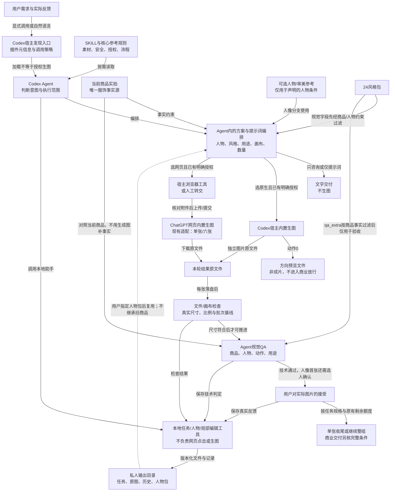

# 裁光能力清单与现状拓扑 / Caiguang capability topology

基线：公开 **beta.12**，发布提交 [`ba60b32`](https://github.com/denggui-ai/threadtruth-studio/commit/ba60b32f4e30c7c105ec4aa198b6826f9e78f451)。本页描述已有职责、依赖和关键分支；图示不构成新的运行规则、生成授权或视觉验证。

**图源就是下面的 Mermaid 代码块。** GitHub 从该代码直接绘图；修改图时修改同一代码块。需要 SVG/PNG 时从它渲染，不另用生图工具绘制一张可能改变连线的图片。

## 能力清单

“已实现”指已有指令或本地工具，不等于所有素材、姿势、宿主都已实图验证。

| 能力 | 用户输入与交付 | 现状及边界 |
|---|---|---|
| 素材核对与服饰识别 | 单件、完整套装、多角度实拍 → 可见服饰事实及缺项 | 只依据当前商品实拍；未知细节不能编造，多套逐套处理 |
| 24风格选择 | 明确偏好或委托推荐 → 一个具体方向，备选/目录按需展开 | 注册风格库与路由已实现；不代表当前版24套六图都通过 |
| 人物选定与条件调整 | 已有真人/AI参考，或无固定人物 → 沿用身份/推荐新人物 | 成人主线有固定、可调、未知与来源；不保证严格真人还原；童装沿用原安全路径 |
| 拍摄与呈现 | 风格、用途及要求 → 棚拍/场景/混合，真人/不露脸/平铺/挂拍/人台 | 自动推荐在三种模式中选；非人像跳过人物身份流程，各形式实图证据不同 |
| 用途与画布 | 电商主图、社媒封面、详情页、品牌展示 → 构图与比例/像素要求 | 明确像素/比例优先；逐张核元数据，不自动生成整页详情、带字海报或保证平台通过 |
| 四种交付 | 仅提示词、方向预览、单张测试或六张独立图 | 提示词0次；预览1次且非成片；单张1次；整组最多6次串行，失败暂停 |
| 两种制作入口 | 已确认方案 → Codex原生，或明确选择ChatGPT网页 | 默认Codex；网页适配单张/六张，需宿主浏览器或手动转交，不自动切换、不用API兜底 |
| 验收与修正 | 原图、结果及反馈 → 人物/商品/用途/画布分项结论 | 技术QA与用户选人分开；只对有依据且获授权的指定图片修正，硬错误不能由满意覆盖 |
| 人物参考包复用 | 已确认人物与新品 → 沿用原始人物依据和已确认条件 | 新聊天需提供包/明确位置；不继承旧商品，新品首张仍需核对；已有受限实图样本 |
| 固定姿势局部换装 | 已确认母图及新品 → 保留姿态的局部编辑结果 | 需手工边界、头脸保护及本地合成校验；依赖现有Node/sharp，不支持自动遮罩或任意转头 |
| 对话与任务恢复 | 一份具体方案、实际授权与反馈 → 执行/继续/恢复/停止 | 已有授权沿用；累计次数、原图和失败历史保留；新简化流程未全面实测 |
| 安装与分发 | Codex插件包 → 预检、备份升级、启用及回滚 | 本机与beta.12发行包已核验；新机器与隐式发现不作普遍通过声明 |

## 职责与依赖主图

这是一张职责/数据拓扑，不是所有箭头都表示执行先后。边上的文字分别说明读取、调用、数据传递或状态保存。恢复与放行条件见下一节。

### 本地工具具体负责什么

| 组件 | 职责 | 不负责什么 |
|---|---|---|
| [插件元信息](../.codex-plugin/plugin.json)与[入口元数据](../skills/threadtruth-studio/agents/openai.yaml) | 发现、显示、默认提示与调用策略 | 不授予生图/上传授权；允许隐式调用不证明所有隐式触发成功 |
| [SKILL.md](../skills/threadtruth-studio/SKILL.md)与核心参考 | 定义输入、选择、执行、QA和停止规则 | 不自动执行工具，不是独立调度服务 |
| [风格路由](../skills/threadtruth-studio/references/style-router.md)与[24风格包](../skills/threadtruth-studio/references/styles/) | 视觉字段参与受约束提示词，QA字段只用于验收 | 不把整个pack原样拼进提示词，不改商品事实 |
| [web-task.py](../skills/threadtruth-studio/scripts/web-task.py) | 原生/网页本地账本，授权记录、预留、回执、尺寸/重复检查、QA/人物确认、恢复与导出 | 不点击Send、不生图、不认证用户实际给过授权、不代替视觉验收；complete不等于image-ready |
| [model-reference.py](../skills/threadtruth-studio/scripts/model-reference.py)及其实现 | 读取、校验和导出私人原始人物、补充图及显式母图 | 不训练模型、不保证锁脸、不把人物包变成商品事实或授权 |
| [wardrobe-edit.cjs](../skills/threadtruth-studio/scripts/wardrobe-edit.cjs) | 可选固定母图的prepare/preflight/apply/verify与局部保护合成 | 不生成供图，不自动判断遮罩，不保证不同母图脸一致或原真人还原 |
| [image-spec-check.py](../skills/threadtruth-studio/scripts/image-spec-check.py)或宿主等价只读检查 | 对实际文件读取并核对比例、像素与同组一致性；网页导入也有自身文件检查 | 不目测代替元数据，不判断商品、身份或商业适用性；不要求所有路线必调同一脚本 |

## 关键分支与状态边界

| 情况 | 下一步与保留条件 | 应核对的规则/回归 |
|---|---|---|
| 只咨询/识别/看风格/要提示词 | 文字出口，不调用生图；已有完整授权不重复询问 | [flow-gates](../skills/threadtruth-studio/references/flow-gates.md)，源侧eval 143–145 |
| 首张返回 | 实际尺寸先符合目标才能建立像素基线；技术QA通过、成人用户接受当前人物后才续整组 | [prompt-build §4.0b](../skills/threadtruth-studio/references/prompt-build.md)，[人物规则](../skills/threadtruth-studio/references/model-selection.md) |
| 后续图片返回 | 每张同时符合目标比例与首张像素基线，再核QA；失败即停后续编号 | 同上；不把尺寸检查拖到最后 |
| 已提交但结果未知 | 恢复同一请求，核实是否仍在生成/已返回；不可重发或新建账本清零 | [网页协议](../skills/threadtruth-studio/references/chatgpt-web.md)，test_unknown_cannot_reconcile_or_retry_before_actual_request_recovery |
| 生成完成但下载失败 | 保留原请求，恢复同一原文件，不增加生图调用 | 网页协议；截图不是原图 |
| 明确终态失败/错误尺寸/损坏返回 | recovery v1保留凭据或原字节；reconcile-failure核实原请求结束后，才可登记新增一次明确重试授权 | [任务回归](../tests/test_model_task.py)：test_known_failure_requires_reason_and_retained_receipt、test_cli_invalid_return_exits_nonzero_after_retaining_failure |
| 旧schema2任务出现错误尺寸 | 显式采用enable-failure-recovery后处理；保留旧状态、次数和文件，不静默迁移；schema1维持旧协议 | test_legacy_schema2_invalid_canvas_remains_reserved_until_explicit_adoption、test_legacy_schema1_recovery_interface_is_unchanged |
| 技术通过但用户拒选人物 | 未确认、无下游时可记录reject-model；明确授权后修订首张，保留原版本和次数 | [人物规则](../skills/threadtruth-studio/references/model-selection.md)、[任务回归](../tests/test_model_task.py) |
| 已确认后换人/换商品/改变上下文 | 新参考版本/任务及相应授权；不覆盖原锚点或清零历史 | 人物规则；已有下游首张不可原地替换 |
| 同人只改场景或其它设置 | 明确“改什么、保留什么”，原人物和当前商品事实仍参与；上下文变化按新任务处理 | 提示词目标须再验收；不能从重试命令推导通用像素级保脸能力 |
| 符合条件的母版1单张续五张 | 沿用原首张和相同上下文，新增五次明确授权；已有整组授权则消费原剩余额度 | continue-authorize与人物确认回归；其它姿势或人物诊断单张不可隐式续组 |
| 用户整体满意 | 技术符合且无硬错误时记录当前图接受；单张结束，已授权整组可继续 | 源侧eval 146–151；这些是行为定义，不是新模型会话实测 |

**三个判断分开记录：** 技术接受表示可推进；人物确认来自用户对实际图像的反馈；`image-ready`还需对应交付结构、逐张元数据、硬错误关闭、商品人工核对和AI标识义务等条件同时满足。预览不进入成片放行；单张不冒充六张组。

## 验证范围与维护

- 本页是按beta.12现有指令、脚本和源侧回归反向梳理；没有因为画图而新增状态机、调用服务或自动重试规则，也没有新生图/视觉评测。
- beta.12发布与文件核验见[发行记录](verification/2026-10-07-beta12-release.md)；产品目标及既有局部图像证据见[开发路线](development/model-selection-roadmap.md)。源侧测试通过不替代摄影质量、严格真人还原或新机器验证。
- 原生和网页是明确选择的两条入口，不是前后工序或自动兜底；非人像跳过人物身份项。网页动作0预览没有列为已实现适配。
- 图/表随实际指令或工具关系变化更新，引用新增/已有回归场景。仅修图文表达不改运行行为；只有可证实的实现问题才进入开发修改。
- 本页是GitHub源码说明，不加入SKILL默认上下文、不改变已发布beta.12 ZIP或已安装插件。
